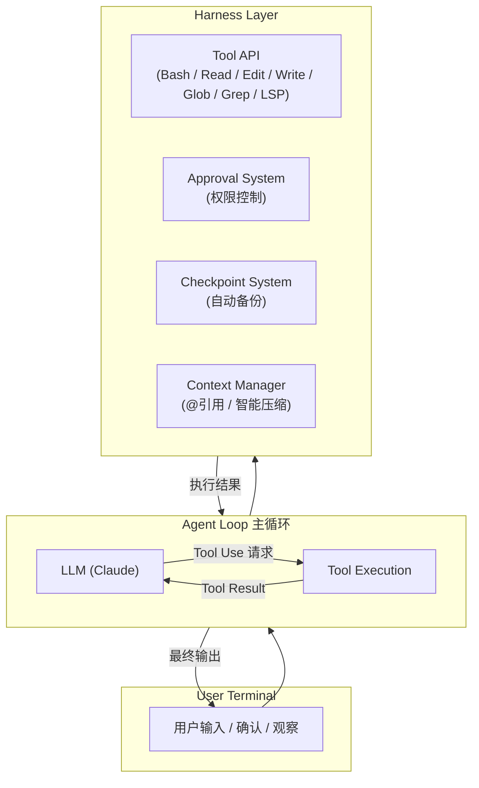
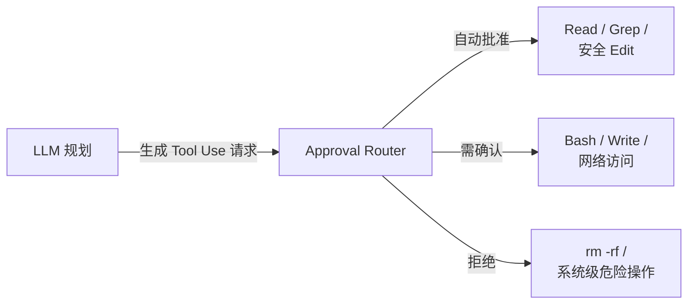
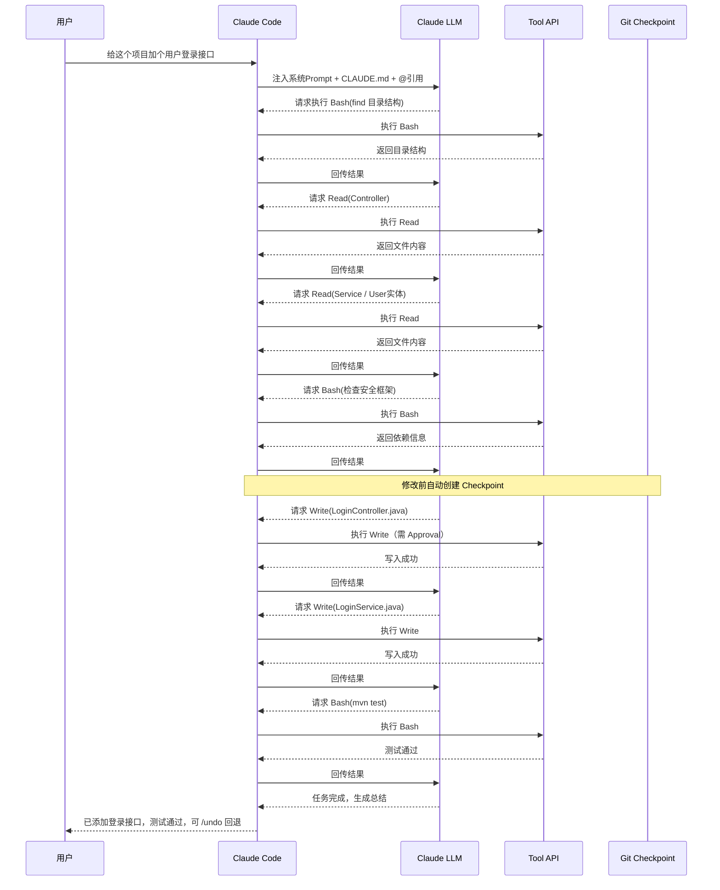

# Claude Code 架构与工作流程

## 一、源码可获取程度说明

- **Claude Code 主应用**（`@anthropic-ai/claude-code`）是一个**闭源**的 npm 包，Anthropic 没有完整开源其全部源码。
- 但从官方文档、CLI 的运行日志、以及 npm 包中暴露的接口和架构文档，可以完整还原它的设计架构和工作流程。

---

## 二、整体架构：一个「受控的 ReAct Agent」

Claude Code 本质上是一个**终端里的 ReAct Agent**，但它的 Harness（外壳）做得非常重。



**关键设计原则：**
1. **LLM 只决策，不直接执行** — 所有文件/系统操作都通过标准化的 Tool API
2. **用户始终在场** — 高风险操作必须经过 Approval System（可配置自动批准低风险操作）
3. **可回滚** — 每次重要修改前自动创建 Git Checkpoint
4. **上下文受控** — 不是把整个项目塞进 Prompt，而是通过 `@` 引用和智能压缩动态管理

---

## 三、四大核心子系统

### 1. Tool API（工具层）

Claude Code 暴露给 LLM 的核心工具非常精简，但足够完成绝大多数编程任务：

| 工具名 | 功能 | 对应 Harness 层级 |
|--------|------|-------------------|
| `Bash` | 执行 Shell 命令 | 执行层 |
| `Read` | 读取文件内容 | 执行层 |
| `Edit` | 编辑/替换文件内容 | 执行层 |
| `Write` | 创建新文件 | 执行层 |
| `Glob` / `Grep` | 文件搜索 | 执行层 |
| `LSP` | 语言服务器交互（查找定义、引用等）| 执行层 |
| `Thinking` | 让 LLM 显式输出思考过程 | 编排层 |

**设计要点：**
- **Edit 不是自由写作**：它要求提供 `old_string` 和 `new_string`，本质上是**受控的 diff 替换**，降低了大范围误改的风险。
- **Bash 受限**：不能执行某些高危命令（如 `rm -rf /`），且网络访问等操作可能需要额外确认。

### 2. Approval System（审批系统）

这是 Claude Code Harness 中最重要的安全层。



**三种模式：**
- `--dangerously-skip-permissions`：完全跳过（不推荐，官方文档警告）
- 默认模式：低风险自动过，高风险暂停等用户输入 `y`
- 严格模式：几乎所有操作都要求确认

### 3. Checkpoint System（检查点系统）

这是 Claude Code 最被低估的工程设计。

**机制：**
- 在 Claude 开始执行任何修改操作前，自动执行 `git stash` 或创建一个临时 commit
- 如果用户不满意结果，可以随时 `/undo` 或 `/checkpoint` 回滚
- 支持 `/checkpoint` 手动打标，方便多分支探索

**意义：**
- 把「AI 编程」从「一次性赌博」变成了「可安全实验的迭代过程」
- 用户敢于让 Claude 做大幅度重构，因为知道能一键回退

### 4. Context Manager（上下文管理系统）

解决大模型上下文窗口不足的问题。

**核心机制：**
- **`@` 引用系统**：用户可以 `@文件名`、 `@文件夹` 或 `@符号名`，Claude 会精准读取这些内容加入上下文，而不是把整个项目塞进去
- **自动上下文**：Agent Loop 会自动维护一个「已读文件列表」，在后续轮次中智能决定哪些内容需要保留、哪些可以丢弃
- **Lazy Loading**：Claude 会先通过 `Glob`/`Grep` 找到相关文件，再 `Read`，而不是一次性加载全部代码

---

## 四、工作流程：一个完整请求的 Lifecycle

以用户输入 **「给这个项目加个用户登录接口」** 为例：



### Step 1: 上下文注入（Context Bootstrap）
Claude Code 在把用户输入发给 LLM 之前，会自动注入：
- 系统 Prompt（包含 Tool 描述、行为规范）
- 当前工作目录信息
- `CLAUDE.md`（如果存在）
- 用户通过 `@` 显式引用的内容

### Step 2: LLM 规划与首次响应
Claude 返回：
```xml
I'll help you add a login API. Let me first explore the project structure.
<function_calls>
<invoke name="Bash">
<parameter name="command">find src -type f | head -20</parameter>
</invoke>
</function_calls>
```

### Step 3: Tool 执行 → Result 回传
系统执行 `Bash` 命令，获取目录结构，把结果包装成 XML 格式回传给 LLM。

### Step 4: 多轮 Agent Loop
Claude 根据结果继续决策，进入循环。每轮流程固定为：
```
LLM 输出 Tool Use → 系统执行 → 结果回传 → LLM 再决策
```

典型的多轮操作序列：

| 轮次 | Tool | 目的 |
|------|------|------|
| 1 | `Read` | 读取现有 Controller 和 Service 结构 |
| 2 | `Read` | 读取 User 实体和数据库配置 |
| 3 | `Bash` | 检查项目使用了什么安全框架（Spring Security / JWT） |
| 4 | `Write` | 创建 LoginController.java（需 Approval）|
| 5 | `Write` | 创建 LoginService.java |
| 6 | `Bash` | 运行 `mvn test` 验证编译 |
| 7 | `Bash` | 运行登录接口单元测试 |

### Step 5: 自然语言总结
当所有 Tool 执行完毕，Claude 输出最终回复：
> "已为您添加登录接口，包含 Controller、Service 和 JWT 验证。所有测试通过。具体改动在 `src/...`，您可以通过 `/undo` 回退。"

### Step 6: Checkpoint 保存
系统自动为本次会话创建 Git checkpoint，用户随时可以：
- `/undo`：回滚本次会话的所有文件修改
- `/checkpoint`：查看历史检查点

---

## 五、从 Harness Engineering 视角映射

把 Claude Code 的架构映射到 Harness Engineering 四层模型：

| Harness 层级 | Claude Code 对应实现 |
|--------------|---------------------|
| **编排层** | Agent Loop + `Thinking` Tool，LLM 自主规划多步任务 |
| **执行层** | `Bash`/`Read`/`Edit`/`Write` 等受控 Tool API |
| **反馈层** | 编译/测试错误回传、LSP 语义检查、用户 Approval 反馈 |
| **记忆层** | `CLAUDE.md`、Session 历史、自动维护的已读文件列表 |

**Claude Code 之所以是 Harness Engineering 的标杆**，就是因为它没有把「Agent」做成一个黑盒，而是：
1. **明确分离了决策（LLM）与执行（Tool API）**
2. **在执行层加入了强安全边界（Approval + 受限命令）**
3. **建立了可靠的反馈闭环（Checkpoint + Test 回传）**
4. **用工程化手段解决了上下文管理问题（@引用 + Lazy Loading）**

---

## 六、给程序员的启示

从 Claude Code 的架构可以学到几个落地原则：

1. **Tool 设计要「原子化」**：不要给 LLM 一个「自由改文件」的权限，而是拆成 `Read` / `Edit` / `Write`，每个工具都有明确的约束。
2. **安全必须内建**：不是事后加权限检查，而是从架构上让 LLM 的所有动作都经过 Approval Router。
3. **可回滚是生产力的前提**：没有 Checkpoint 的 AI 编程工具，用户不敢用。
4. **上下文管理比 Prompt 技巧更重要**：Claude Code 的聪明不在于 Prompt 多精妙，而在于它只给 LLM 看「该看的东西」。

---

## 七、最佳实践与提示词技巧（基于官方文档）

> 来源：https://code.claude.com/docs/zh-CN/best-practices

### 1. 给 Claude 一种验证其工作的方式

Claude 能自我验证时，输出质量会显著提升。要在提示中明确要求验证步骤：

| 场景 | 之前 | 之后 |
|------|------|------|
| **提供验证标准** | "实现一个邮箱验证函数" | "编写 validateEmail 函数，以 user@example.com 为真、invalid 为假。实现后运行测试。" |
| **UI 验收** | "把按钮做好看点" | "[粘贴截图] 实现这个设计。对比原始设计，列出差异并修改。" |
| **说明原则，指出症状** | "修一下这个 bug" | "测试失败，报错[粘贴日志]。查看 src/auth/ 的认证流程，特别注意 token 刷新。写个失败用例复现问题，然后修复。" |

**核心原则**：把「写完代码」变成「写完 + 验证通过」。

---

### 2. 先探索，再规划，最后编码

不要直接让 Claude 写代码，而是分三步走：

1. **探索（Plan Mode）**：让 Claude 只读文件、理解现状，不做任何修改
   ```
   read /src/auth and understand how we handle sessions and login.
   also look at how we manage environment variables for secrets.
   ```
2. **规划（Plan Mode）**：要求 Claude 输出详细的实施计划
   ```
   I want to add Google OAuth. What files need to change?
   What's the session flow? Create a plan.
   ```
   - 按 `Ctrl+G` 可在文本编辑器中直接编辑计划，然后让 Claude 执行
3. **实现（Normal Mode）**：切换到正常模式，按规划执行并验证
   ```
   implement the OAuth flow from your plan. write tests for the
   callback handler, run the test suite and fix any failures.
   ```
4. **提交**：要求 Claude 使用描述性信息提交并开 PR
   ```
   commit with a descriptive message and open a PR
   ```

> **Plan Mode 的妙用**：范围明确、修改量小（如拼写错误、日志修改）时，不需要 Plan Mode，直接执行即可。但对于涉及多个文件或不熟悉的修改，规划能大幅降低返工率。

---

### 3. 在提示中提供具体的上下文

指令越精确，需要的轮次越少。

| 技巧 | 之前 | 之后 |
|------|------|------|
| **限定修改范围** | "给 foo.py 加测试" | "为 foo.py 写单元测试，只测边界条件，用 mock 隔离外部依赖。" |
| **指定信源** | "为什么 ExecutionFactory 会调用 api？" | "查看 ExecutionFactory 的 git 历史，总结 api 调用是如何形成的。" |
| **参考现有模式** | "写个分页组件" | "参考现有分页组件的实现方式。HotDogWidget.php 是个很好的例子。按那个模式实现一个新的分页组件，支持用户选择每页条数、前后页跳转。从头部开始，不要改动现有使用的主题和样式。" |
| **描述症状** | "修改登录逻辑" | "用户刷新页面时登录失败。查看 src/auth/ 中的认证流程，特别关注 token 刷新。写一个失败的复现用例，定位问题，然后修复。" |

**探索性提示**：当你不确定该问什么时，用 "这些文件的关系是什么？" 来让 Claude 帮你发现隐藏关联。

---

### 4. 提供丰富的内容

用 `@`、粘贴、URL、管道等方式把上下文喂给 Claude：

- **`@` 引用文件**：精确指定代码位置，Claude 会在响应前读取
- **直接粘贴截图**：UI/设计相关任务特别有效
- **提供 URL**：文档或 API 参考。用 `/permissions` 查看 Claude 能访问的域名列表
- **管道输入**：`cat error.log | claude` 直接把日志传给 Claude
- **让 Claude 自己读取**：鼓励 Claude 使用 Bash 命令、MCP 工具或文件读取来获取它需要的信息

---

### 5. 配置环境

#### 5.1 编写有效的 CLAUDE.md

- 用 `/init` 根据当前项目结构自动生成 CLAUDE.md 草稿，再逐步精简
- CLAUDE.md 没有固定格式，核心是**简洁且高杠杆**的内容
- 只放广泛适用的约定，临时性知识用 **skills** 存储
- 要保持精简：如果 Claude 已经在做某事，说明它可能已掌握，不需要重复写入
- 可以用 `@path/to/import` 语法在 CLAUDE.md 中引用其他文件
- **放置位置**：
  - `~/.claude/CLAUDE.md` — 全局，适用于所有 Claude 会话
  - `./CLAUDE.md` — 项目根目录，与团队共享
  - 子目录 — monorepos 场景，`root/CLAUDE.md` 和 `root/foo/CLAUDE.md` 会自动合并
  - 孙目录 — 处理这些目录中的文件时，Claude 会读取该层的 CLAUDE.md

#### 5.2 配置权限

- 使用 **auto mode** 消除大部分提示中断，配合 `/permissions` 管理允许列表，或使用 `/sandbox` 进行系统级隔离
- 默认情况下 Claude Code 会请求修改系统权限（文件写入、Bash、MCP 等），但三种方式可以安全地减少中断：
  1. **Auto mode**：在已知安全范围内自动批准，禁止未知操作
  2. **权限允许列表**：把安全的特定命令加入白名单（如 `npm run lint`、`git commit`）
  3. **Sandbox**：操作系统级隔离，限制文件系统访问范围

#### 5.3 使用 CLI 工具

- 让 Claude 使用外部 CLI 工具（如 `gh`、`aws`、`gcloud`、`sentry-cli`）与外部服务交互
- 例如：安装 `gh` CLI 后，Claude 知道如何创建 issue、拉取 PR、提交评论
- 可以提示： `"Use 'foo-cli-tool --help' to learn about foo tool, then use it to solve A, B, C."`

#### 5.4 连接 MCP 服务器

- 用 `claude mcp add` 连接外部工具（如 Notion、Figma、数据库）
- MCP 让 Claude 能执行它本身没有的功能：查询数据库、管理云资源、读取 Figma 设计稿

#### 5.5 设置 Hooks

- Hooks 是在 Claude 执行特定操作时自动运行的脚本，与 CLAUDE.md 指令不同，hooks 是**确定性**的验证或约束
- 例如："写一个每次文件编辑后运行 eslint 的 hook"、"写一个禁止写入迁移文件的 hook"
- 编辑 `.claude/settings.json` 配置 hooks，或用 `/hooks` 查看当前启用的 hooks

#### 5.6 创建 Skills

- 在 `.claude/skills/` 下创建 `SKILL.md` 文件，为 Claude 提供特定知识和可复用工作流
- Claude 会在需要时自动应用，也可以用 `/skill-name` 直接调用
- 示例：`.claude/skills/api-conventions/SKILL.md` 定义 API 设计规范
- 示例：`.claude/skills/fix-issue/SKILL.md` 定义修 issue 的 8 步标准流程（`disable-model-invocation: true` 表示作为工作流直接执行）

#### 5.7 创建自定义 Subagents

- 在 `.claude/agents/` 下定义专门角色，Claude 可以委派给它们做独立研究
- Subagents 有自己的 context budget 和专属工具集，适合读取大量文件后做摘要，不污染主对话
- 示例：`.claude/agents/security-reviewer.md` — 指定模型为 `opus`，工具为 `Read, Grep, Glob, Bash`，负责代码安全审查
- 提示技巧：明确说 `"use subagent to review this for security issues"`

#### 5.8 安装 Plugins

- 用 `/plugin` 查看可用插件，为 Claude 提供更精确的符号搜索和编辑能力

---

### 6. 有效沟通

#### 6.1 提出代码库问题

把 Claude Code 当作一位资深工程师同事来提问：
- "这段代码为什么这样设计？"
- "这里有没有未记录的 API 端点？"
- "foo.rs 第 134 行的 `async move { ... }` 是什么？"
- "CustomerOnboardingFlowImpl 有哪些边界条件？"
- "为什么第 333 行调用的是 `foo()` 而不是 `bar()`？"

这种问法能获得比单纯"解释这段代码"更深入的见解。

#### 6.2 让 Claude 采访你

在构建复杂功能时，先让 Claude 通过 `AskUserQuestion` 工具采访你：
```
I want to build [brief description]. Interview me in detail using the AskUserQuestion tool.

Ask about technical implementation, UI/UX, edge cases, concerns, and tradeoffs. Don't ask obvious questions, dig into the hard parts I might not have considered.

Keep interviewing until we've covered everything, then write a complete spec to SPEC.md.
```

这样能在开始实现前把需求挖透，产出的 SPEC.md 可作为后续会话的参考。

---

### 7. 管理会话

#### 7.1 尽早且经常修正方向

- **`Esc`**：立即停止 Claude，保留 context
- **`Esc + Esc` 或 `/rewind`**：进入 rewind 菜单，恢复之前的对话和代码状态，可选摘要信息或丢弃
- **`"不是这样"`**：让 Claude 重新做
- **`/clear`**：在不相关的任务之间清空 context，无关的 context 只会降低性能

> 如果同一问题在会话中反复失败，context 可能已经污染。用 `/clear` + 更好的初始提示重新开始，往往比在同一对话中纠缠更有效。

#### 7.2 积极管理 Context

- Claude Code 会在接近 context 上限时自动压缩对话历史，但长会话中无关内容仍会累积
- **策略**：
  - 任务切换后频繁使用 `/clear`
  - 自动压缩时，Claude 会总结关键模式、文件状态和核心约束
  - 用 `/compact <instructions>` 自定义压缩行为，例如 `/compact Focus on the API changes`
  - 用 `Esc + Esc` 或 `/rewind` 选择消息点并「总结到此」，压缩该点之前的消息同时保留后续 context
  - 在 CLAUDE.md 中指定压缩规则： `"When compacting, always preserve the full list of modified files and any test commands"`
  - 对于不想污染对话历史的小问题，用 `/btw`（答案出现在可关闭的侧边栏中）

#### 7.3 使用 Subagents 进行调查

当 Claude 需要研究大量文件时，明确说：
```
Use subagents to investigate how our authentication system handles token
refresh, and whether we have any existing OAuth utilities I should reuse.
```

Subagent 会独立探索、读取文件、发现后返回摘要，不占用主对话 context。
也可以让 Claude 在实现后用 subagent 做验证：
```
use a subagent to review this code for edge cases
```

#### 7.4 使用 Checkpoint 进行 Rewind

- Claude 每次修改前自动创建检查点
- 双击 `Escape` 或输入 `/rewind` 进入 rewind 菜单，可回滚对话、恢复代码或选择信息摘要
- 适合场景：尝试不同方案、关闭终端测试后仍然 rewind、大胆实验
- ⚠️ **注意**：rewind 只恢复 Claude 执行的修改，不恢复你自己的外部编辑。这不是 git 替代品。

#### 7.5 恢复对话

- `claude --continue`：恢复最近的对话
- `claude --resume`：从最近的对话列表中选择
- 使用 `/rename` 给对话起有意义的名称（如 `"oauth-migration"`、`"debugging-memory-leak"`），方便后续查找
- 每个对话在内部都存储了完整的持久 context

---

### 8. 自动化和扩展

#### 8.1 运行非交互模式

用 `claude -p "prompt"` 在 CI、pre-commit hooks 或脚本中调用 Claude：

```bash
# 一次性查询
claude -p "Explain what this project does"

# 结构化输出（JSON）
claude -p "List all API endpoints" --output-format json

# 流式输出（实时处理）
claude -p "Analyze this log file" --output-format stream-json
```

#### 8.2 运行多个 Claude 会话

Claude Code 支持并行会话：
- **桌面应用**：以标签页形式打开多个会话，每个会话有自己的 git worktree
- **Web 版**：在 Anthropic 的安全虚拟机中运行
- **Agent teams**：让多个会话自动协作（实验性功能）

**Writer/Reviewer 模式示例**：

| 会话 A（Writer） | 会话 B（Reviewer） |
|------------------|-------------------|
| "为我们的 API 端点实现速率限制" | |
| | "审查 @src/middleware/rateLimiter.ts 中的实现。检查边界条件、测试覆盖、模式一致性。" |
| "根据[会话 B 反馈]修复这些问题。" | |

#### 8.3 跨文件扇出

对于大规模迁移（如修改 2000 个文件），不要在一个会话中完成，而是：

1. 让 Claude 列出需要迁移的文件列表
2. 写脚本循环调用 `claude -p`：
   ```bash
   for file in $(cat files.txt); do
     claude -p "Migrate $file from React to Vue. Return OK or FAIL." \
       --allowedTools "Edit,Bash(git commit *)"
   done
   ```
3. 先用前 2-3 个文件测试脚本，确认无误后批量运行
4. 也可以把 Claude 的输出通过管道传给其他命令：`claude -p "<prompt>" --output-format json | your_command`

#### 8.4 使用 Auto Mode 自主运行

在后台或流水线中使用 auto mode 减少人工干预：
```bash
claude --permission-mode auto -p "fix all lint errors"
```

> 在 `-p` 非交互模式下使用 auto mode 特别有效，因为它会反复执行直到完成。但要了解 auto mode 的降级行为（遇到超范围操作时还是会暂停）。

---

### 9. 避免常见失败模式

| 失败模式 | 表现 | 修复方法 |
|----------|------|----------|
| **对话泡水** | 偏离主题，context 中塞满无关信息 | 任务切换后用 `/clear` |
| **反复在同一处失败** | Claude 屡教不改，context 已污染 | `/clear` 后重写更好的初始提示 |
| **CLAUDE.md 膨胀** | 文件太大，关键指令被稀释 | 删除冗余，把临时指令转为 skill/hook |
| **缺少验证** | Claude 写完代码但不验证 | 初始提示中明确要求测试/截图/lint |
| **过度探索** | Claude 读了几十上百个文件 | 明确限定范围，或使用 subagents |

---

### 10. 培养直觉

最佳实践中的模式不是一成不变的。以下直觉需要长期积累：

- **何时应该让 context 积累？** 当它是同一复杂问题的连续推进时，历史有价值。
- **何时应该打断 Claude 重新规划？** 当 Claude 开始重复尝试同一错误策略时。
- **何时应该要求显式计划？** 当你想看到 Claude 的推理过程，确保不偏离轨道时。
- **为何 Context 太多、提示太模糊会导致失败？** 因为 LLM 的注意力被稀释。
- **何时应该积累、何时应该清空、何时应该规划、何时应该探索、何时应该使用 subagent？** 没有标准答案，需要在实践中观察 Claude 的表现，不断调整。

---

*记录时间：2026-04-14*
