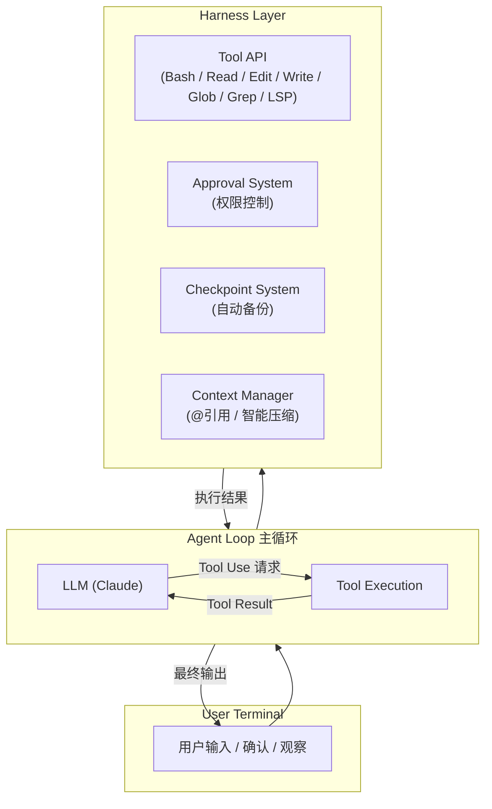
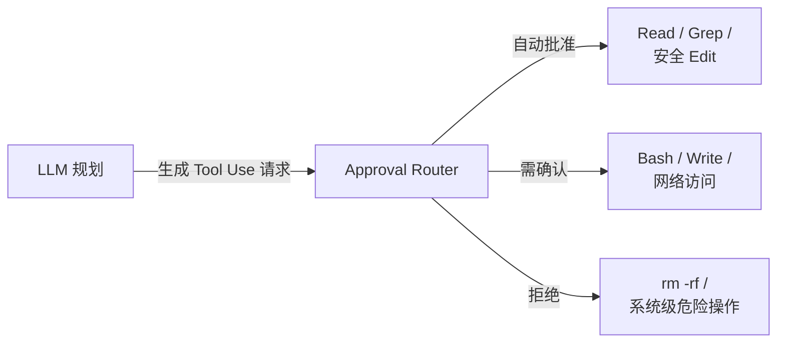
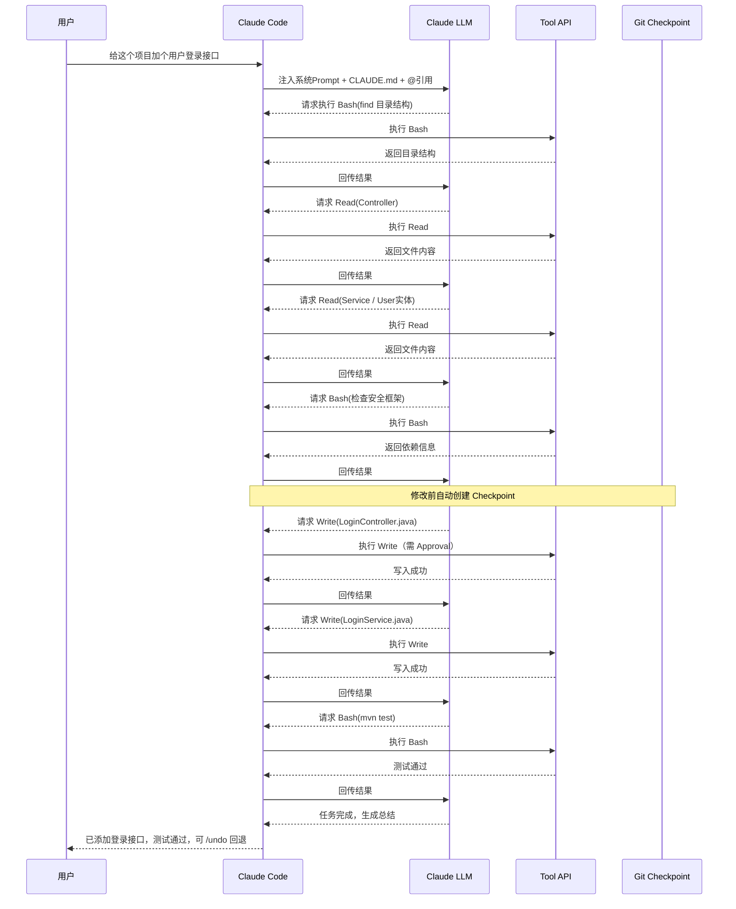

# Claude Code 架构与工作流程

## 一、源码可获取程度说明

- **Claude Code 主应用**（`@anthropic-ai/claude-code`）是一个**闭源**的 npm 包，Anthropic 没有完整开源其全部源码。
- 但从官方文档、CLI 的运行日志、以及 npm 包中暴露的接口和架构文档，可以完整还原它的设计架构和工作流程。

---

## 二、整体架构：一个「受控的 ReAct Agent」

Claude Code 本质上是一个**终端里的 ReAct Agent**，但它的 Harness（外壳）做得非常重。



**关键设计原则：**
1. **LLM 只决策，不直接执行** — 所有文件/系统操作都通过标准化的 Tool API
2. **用户始终在场** — 高风险操作必须经过 Approval System（可配置自动批准低风险操作）
3. **可回滚** — 每次重要修改前自动创建 Git Checkpoint
4. **上下文受控** — 不是把整个项目塞进 Prompt，而是通过 `@` 引用和智能压缩动态管理

---

## 三、四大核心子系统

### 1. Tool API（工具层）

Claude Code 暴露给 LLM 的核心工具非常精简，但足够完成绝大多数编程任务：

| 工具名 | 功能 | 对应 Harness 层级 |
|--------|------|-------------------|
| `Bash` | 执行 Shell 命令 | 执行层 |
| `Read` | 读取文件内容 | 执行层 |
| `Edit` | 编辑/替换文件内容 | 执行层 |
| `Write` | 创建新文件 | 执行层 |
| `Glob` / `Grep` | 文件搜索 | 执行层 |
| `LSP` | 语言服务器交互（查找定义、引用等）| 执行层 |
| `Thinking` | 让 LLM 显式输出思考过程 | 编排层 |

**设计要点：**
- **Edit 不是自由写作**：它要求提供 `old_string` 和 `new_string`，本质上是**受控的 diff 替换**，降低了大范围误改的风险。
- **Bash 受限**：不能执行某些高危命令（如 `rm -rf /`），且网络访问等操作可能需要额外确认。

### 2. Approval System（审批系统）

这是 Claude Code Harness 中最重要的安全层。



**三种模式：**
- `--dangerously-skip-permissions`：完全跳过（不推荐，官方文档警告）
- 默认模式：低风险自动过，高风险暂停等用户输入 `y`
- 严格模式：几乎所有操作都要求确认

### 3. Checkpoint System（检查点系统）

这是 Claude Code 最被低估的工程设计。

**机制：**
- 在 Claude 开始执行任何修改操作前，自动执行 `git stash` 或创建一个临时 commit
- 如果用户不满意结果，可以随时 `/undo` 或 `/checkpoint` 回滚
- 支持 `/checkpoint` 手动打标，方便多分支探索

**意义：**
- 把「AI 编程」从「一次性赌博」变成了「可安全实验的迭代过程」
- 用户敢于让 Claude 做大幅度重构，因为知道能一键回退

### 4. Context Manager（上下文管理系统）

解决大模型上下文窗口不足的问题。

**核心机制：**
- **`@` 引用系统**：用户可以 `@文件名`、 `@文件夹` 或 `@符号名`，Claude 会精准读取这些内容加入上下文，而不是把整个项目塞进去
- **自动上下文**：Agent Loop 会自动维护一个「已读文件列表」，在后续轮次中智能决定哪些内容需要保留、哪些可以丢弃
- **Lazy Loading**：Claude 会先通过 `Glob`/`Grep` 找到相关文件，再 `Read`，而不是一次性加载全部代码

---

## 四、工作流程：一个完整请求的 Lifecycle

以用户输入 **「给这个项目加个用户登录接口」** 为例：



### Step 1: 上下文注入（Context Bootstrap）
Claude Code 在把用户输入发给 LLM 之前，会自动注入：
- 系统 Prompt（包含 Tool 描述、行为规范）
- 当前工作目录信息
- `CLAUDE.md`（如果存在）
- 用户通过 `@` 显式引用的内容

### Step 2: LLM 规划与首次响应
Claude 返回：
```xml
I'll help you add a login API. Let me first explore the project structure.
<function_calls>
<invoke name="Bash">
<parameter name="command">find src -type f | head -20</parameter>
</invoke>
</function_calls>
```

### Step 3: Tool 执行 → Result 回传
系统执行 `Bash` 命令，获取目录结构，把结果包装成 XML 格式回传给 LLM。

### Step 4: 多轮 Agent Loop
Claude 根据结果继续决策，进入循环。每轮流程固定为：
```
LLM 输出 Tool Use → 系统执行 → 结果回传 → LLM 再决策
```

典型的多轮操作序列：

| 轮次 | Tool | 目的 |
|------|------|------|
| 1 | `Read` | 读取现有 Controller 和 Service 结构 |
| 2 | `Read` | 读取 User 实体和数据库配置 |
| 3 | `Bash` | 检查项目使用了什么安全框架（Spring Security / JWT） |
| 4 | `Write` | 创建 LoginController.java（需 Approval）|
| 5 | `Write` | 创建 LoginService.java |
| 6 | `Bash` | 运行 `mvn test` 验证编译 |
| 7 | `Bash` | 运行登录接口单元测试 |

### Step 5: 自然语言总结
当所有 Tool 执行完毕，Claude 输出最终回复：
> "已为您添加登录接口，包含 Controller、Service 和 JWT 验证。所有测试通过。具体改动在 `src/...`，您可以通过 `/undo` 回退。"

### Step 6: Checkpoint 保存
系统自动为本次会话创建 Git checkpoint，用户随时可以：
- `/undo`：回滚本次会话的所有文件修改
- `/checkpoint`：查看历史检查点

---

## 五、从 Harness Engineering 视角映射

把 Claude Code 的架构映射到 Harness Engineering 四层模型：

| Harness 层级 | Claude Code 对应实现 |
|--------------|---------------------|
| **编排层** | Agent Loop + `Thinking` Tool，LLM 自主规划多步任务 |
| **执行层** | `Bash`/`Read`/`Edit`/`Write` 等受控 Tool API |
| **反馈层** | 编译/测试错误回传、LSP 语义检查、用户 Approval 反馈 |
| **记忆层** | `CLAUDE.md`、Session 历史、自动维护的已读文件列表 |

**Claude Code 之所以是 Harness Engineering 的标杆**，就是因为它没有把「Agent」做成一个黑盒，而是：
1. **明确分离了决策（LLM）与执行（Tool API）**
2. **在执行层加入了强安全边界（Approval + 受限命令）**
3. **建立了可靠的反馈闭环（Checkpoint + Test 回传）**
4. **用工程化手段解决了上下文管理问题（@引用 + Lazy Loading）**

---

## 六、给程序员的启示

从 Claude Code 的架构可以学到几个落地原则：

1. **Tool 设计要「原子化」**：不要给 LLM 一个「自由改文件」的权限，而是拆成 `Read` / `Edit` / `Write`，每个工具都有明确的约束。
2. **安全必须内建**：不是事后加权限检查，而是从架构上让 LLM 的所有动作都经过 Approval Router。
3. **可回滚是生产力的前提**：没有 Checkpoint 的 AI 编程工具，用户不敢用。
4. **上下文管理比 Prompt 技巧更重要**：Claude Code 的聪明不在于 Prompt 多精妙，而在于它只给 LLM 看「该看的东西」。

---

*记录时间：2026-04-14*
