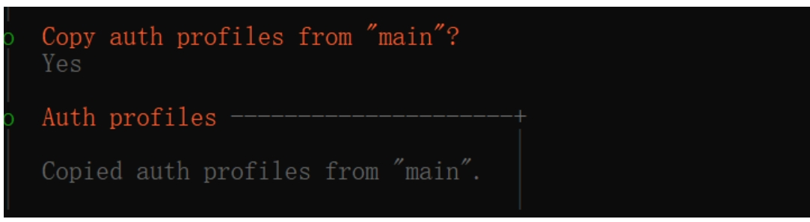
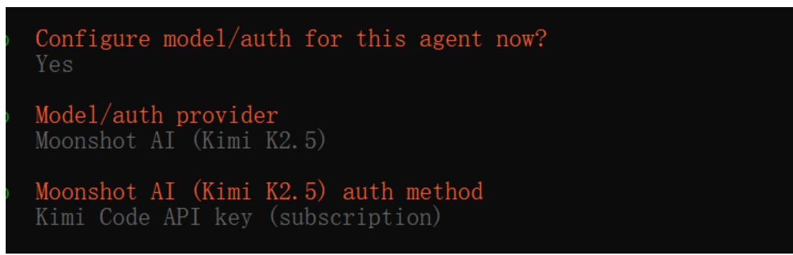
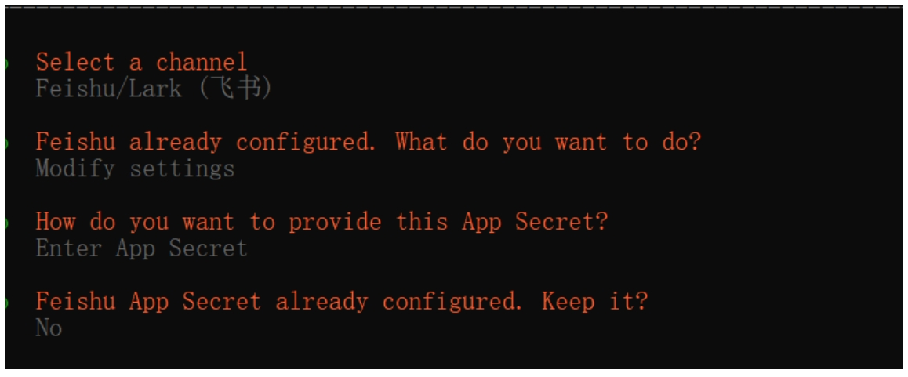
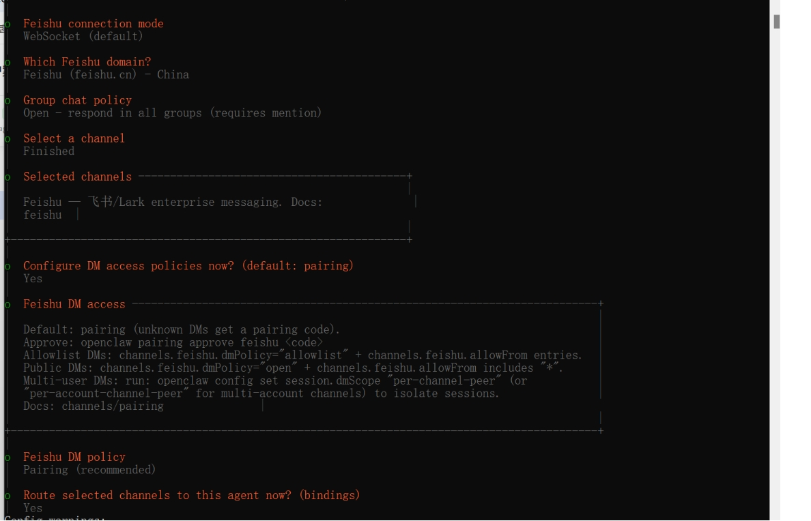

# openclaw如何配置多agent

## 步骤

### 1、命令行中添加新的agent

```bash
openclaw agents add financialAssistant
```

> 注：`financialAssistant` 为agent的自定义名称，可根据需求修改

### 2、复制主对话配置

openclaw会问你是否直接复制主对话的配置，以及权限。可以先直接选择 **Yes**，后续都可以再更改。



### 3、设置模型以及api-key

选择模型提供商和认证方式：



### 4、配置channel（以飞书为例）

#### 4.1 飞书开放平台配置
- 第一步：在**飞书开放平台** → **开发者后台** → **创建企业应用**
- 然后进行**权限设置**，**版本发布**，就会得到一个机器人

#### 4.2 配置机器人凭证
- 在命令行中openclaw会问你是否需要重新设置appcode的secret（机器人相关配置）
- 这里需要重新配置，在**机器人** → **凭证与基础信息**中有对应的信息



#### 4.3 命令行配置选项
配置好机器人信息之后回到命令行，一路按照下述选择进行执行：



#### 4.4 飞书开发者平台设置
在完成绑定之后，回到飞书开发者平台，选择：

**事件与回调** → **订阅方式** → **长连接** →添加事件（添加消息与群组中的所有选项）→ **确认**

然后就可以去飞书搜索机器人进行对话了。

### 5、绑定确认

第一次发起对话，机器人会发送绑定码。这时候，复制绑定信息中的最后一行：

```bash
openclaw pairing approve feishu xxxxxx
```

直接到命令行中进行执行。

完成！你就获得了另一个openclaw agent助手。

---

*记录时间：2026-03-14*
